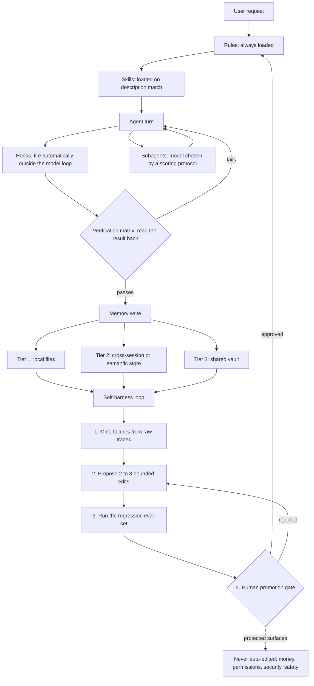

# Architecture

Seven layers, in the order a request moves through them.

## The layers

### Rules (`rules/`)

Twelve markdown files, always loaded into every session. They are the behavioral constitution:
what the agent must never guess, how it batches work, how it routes subagents to a model tier,
how it treats memory, and how the self-improvement loop is allowed to change any of this. Every
rule that matters carries the incident that produced it, generalized so it teaches the lesson
without naming anyone. Read them in full before you install; they are the highest-value files in
this repo.

### Skills (`skills/`)

A library of on-demand skill files, each with a description Claude Code matches against the task
at hand. A skill only enters context when it is relevant, which is what keeps the always-loaded
rules thin. This repo ships a curated subset: generic engineering, testing, documentation, and
design skills. Some skills reference a companion skill that is not included in this build; that
reference is a pointer to write or find your own, not a broken dependency, and each skill still
functions stand-alone.

### Hooks (`scripts/`)

Small scripts that fire on tool events, outside the model's own reasoning: a secret scanner, a
dangerous-Bash-command blocker, a credential-file edit guard, a post-edit syntax linter, and a
manual PowerShell parse checker. `self-harness-mine.cjs` is not a hook; it is the Stage 1 tool
of the self-improvement loop below, run on a schedule you choose. None of these are wired into
`settings.json` automatically. `hooks-suggestions.json` at the repo root lists the event and
matcher each script expects; wiring them in is a deliberate, manual step.

### Subagents

Multi-step, isolated, or high-token work is delegated to a subagent rather than done in the main
session. Each spawn carries a real fixed cost before it reads a word of its brief, so the rules
favor fewer, larger briefs over many narrow ones. Which model tier a subagent gets is not a
feeling, it is a score.

### The model scoring protocol

Every subagent task is scored across six dimensions, zero to ten each: novelty, how many domains
it crosses, the stakes if it is wrong, how deep the output needs to be, how much ambiguity it
carries, and how much context it needs. The total maps to a tier: low scores go to the fast/cheap
model, mid scores to the standard model, and only genuinely high-stakes or novel work earns the
top tier. "This feels complex" is explicitly not a valid justification on its own; the rule
requires the score.

### Verification

Every deliverable type in the verification matrix has a named tool that observes the actual
output: an API readback, a rendered screenshot, a parsed script, a re-derived number, a listed
file. A self-asserted pass with no tool observation does not count. The loop is follow, self-check,
correct, budgeted at two or three iterations before escalating with evidence instead of looping
forever.

### Memory (three tiers)

See "The memory model" below.

### The self-harness loop

The self-improvement mechanism. Covered in its own section below, since it is the part of this
repo most worth understanding before you turn it on.

## The memory model

Three tiers, each with one job:

- **Local files.** Markdown next to the agent's own config, indexed by one file. Fast, greppable,
  works with no network.
- **Cross-session or semantic store.** Recall by meaning, not exact words, for "we solved
  something like this before."
- **Shared vault.** Every agent reads and writes it, so one agent's finding becomes another
  agent's starting point instead of a rediscovery.

If your setup only has local files, keep them. The rules degrade gracefully: every reference to
writing the shared or semantic tier becomes "skip that write." The five behaviors below are the
actual transferable content, independent of how many tiers you run.

| Rule | What it means in practice |
|---|---|
| One canonical home per fact | Every other tier holds a pointer, never a second copy. A duplicate is a future contradiction with a delay fuse. |
| Readback before claim | After any write, read the value back from where it should have landed. A success response is not proof; a third-party API can return 200 while silently dropping the write. |
| Critique before acting | A recalled memory is a draft, not a script. State what still applies, drop what does not, or reject it entirely and reason from current evidence. |
| Fail open, always | No memory tier may block a turn. A missing tier degrades the answer; it never stops the work. |
| Write the boundary | Every memory records when it applies and when it does not, so a future read can critique it in one pass. |

`memory-integrity.rules.md` expands this into eleven numbered rules, each traceable to a real
incident class: warnings nobody reads, exit codes mistaken for verification, audit findings
repeated before re-testing, "not found" claimed from a single search, summaries that drop a
caveat the long version carried, a file that exists but is empty, a deleted note that orphans
a link, a status that goes stale because nothing revisited it, and a review agent briefed against
a target that changed underneath it while it worked. Read that file in full; it is the densest
concentration of hard-won lessons in the repo.

## Why this is different

Written flat, no hype.

- **Self-improvement with a human gate.** Most agent configurations grow only when someone
  notices a problem and hand-writes a fix. This one mines its own failure record into clusters,
  proposes two or three bounded edits per cluster, runs each candidate against a fixed regression
  eval set, and requires a human to type an explicit approval before anything merges. A candidate
  that improves one dimension while degrading another is rejected outright. Money, permissions,
  security, and safety rules can never be auto-edited, full stop; the loop can flag them but never
  apply a change to them itself.
- **Proposals are grounded in raw traces, not summaries.** The proposer is required to read the
  actual transcripts and logs behind a failure cluster before drafting a fix, not just the
  one-paragraph summary of them. Summary-only proposing measurably underperforms trace-grounded
  proposing in the research this loop is adapted from.
- **Verification is a matrix, not a habit.** Every deliverable type has a named tool that observes
  the output, not the agent's intention. Twelve rows are defined; add your own as your own
  deliverable types accumulate.
- **Model routing is scored, not vibed.** Six dimensions, zero to ten each, mapped to a tier, so
  the expensive model has to earn its assignment on paper.
- **Parity is a completion gate.** If you run more than one agent config tree, a skill installed
  on one and not the others counts as unfinished work, and the rule says so directly.
- **The rules carry their catalysts.** Nearly every rule names the failure that produced it. That
  makes them worth reading even if you never install a single file, because the failure mode is
  usually the useful part.

## Known limits

Say these plainly rather than let someone discover them the hard way.

- **The eval runner ships with 3 starter cases, not a finished suite.** `self-harness/run-eval.cjs`
  defines the case format and three deterministic checks (`parse_js`, `no_em_dash`,
  `readback_after_write`), and `self-harness/fixtures/` ships the good/bad fixture pairs for all
  three (E1 parse, E2 no-em-dash, E3 readback-after-write). `node self-harness/run-eval.cjs`
  passes 3/3 out of the box. Write your own fixture cases against your own real failures as your
  harness accumulates them; `eval-set.md` documents the format and the "Adding a case" steps.
- **The self-harness behavior judge needs its own setup, and it sends data off your machine.**
  `self-harness/judge.py` needs `pip install autoevals` plus an `OPENROUTER_API_KEY` or
  `ANTHROPIC_API_KEY` in the environment. `self-harness/behavior-judge.py` reads `BEHAVIOR.md`
  specs from `.agents/behaviors/`; this build ships a starter `.agents/behaviors/README.md`
  explaining the format plus one neutral example spec (`readback-before-claim/BEHAVIOR.md`). It
  pulls excerpts from your session transcripts, redacts them with the same secret-shaped patterns
  `secret-scanner.js` uses, and sends the redacted excerpt to the model endpoint `judge.py`
  targets, but only after you opt in (`--yes-send-transcripts` or
  `SAM_HARNESS_ALLOW_REMOTE_JUDGE=1`) - it refuses and prints what would be sent otherwise.
  Redaction is pattern-based, not a guarantee: read `judge.py`'s `redact()` before trusting it
  with anything sensitive. Neither script runs unattended out of the box; wire them into your own
  schedule once you have real trajectories to judge.
- **The miner's failure-mechanism vocabulary is a starting point**, not a finished taxonomy. It
  will miss mechanisms your own work produces until you extend it.
- **Hook wiring is manual by design.** The installer never touches `settings.json`. You decide
  which of the six scripts to turn on and where, using `hooks-suggestions.json` as the reference,
  not as something applied for you.
- **This was tuned on one person's work.** Some of it will not transfer to yours. Read the
  catalyst behind a rule before you decide whether it applies to you; several rules say exactly
  what conditions they apply under and what they do not.
