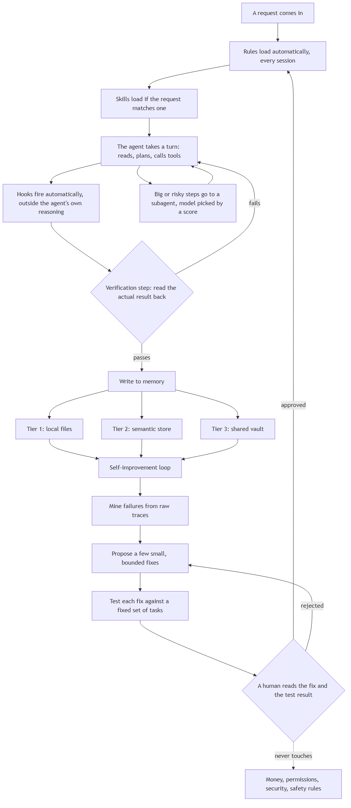
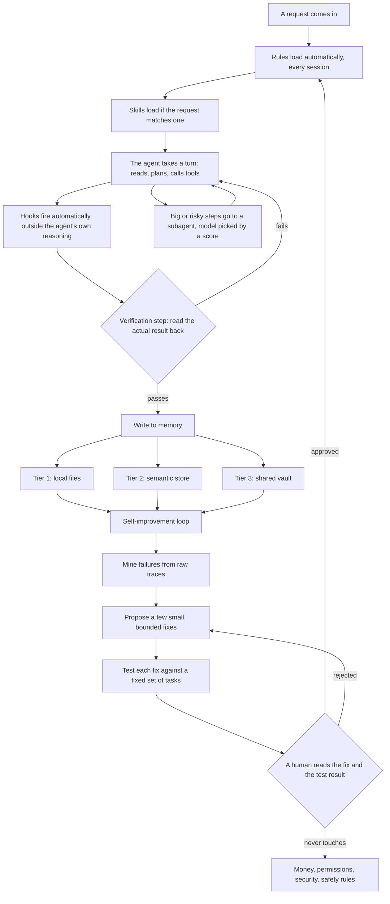

<p align="center"></p>

# SAM Agentic Harness

**Created by [Social Ads Mentor](https://socialadsmentor.com) (SAM), the paid-media and AI-implementation practice of Sam Bell.** This is the harness that runs our own agent fleet, scrubbed for public use.

A configuration layer for Claude Code: always-loaded rules, skills that load on match,
automatic hooks, scored subagent routing, a three-tier memory convention, and a
self-improvement loop with a mandatory human approval gate.

## Table of contents

1. [What this is](#1-what-this-is)
2. [What you get](#2-what-you-get)
3. [How the pieces fit](#3-how-the-pieces-fit)
4. [The memory system, explained](#4-the-memory-system-explained)
5. [Why this is different](#5-why-this-is-different)
6. [Install](#6-install)
7. [What leaves your machine](#7-what-leaves-your-machine)
8. [Layout of the repo](#8-layout-of-the-repo)
9. [Provenance and license](#9-provenance-and-license)
10. [Attribution](#10-attribution)

## 1. What this is

Claude Code ships as a blank command-line tool. It can read files, write code, and run
commands, but it starts every session with no memory of what worked last time, no rules
about how carefully to check its own work, and no sense of when a task is small enough to
do directly versus big enough to hand off to a helper process. SAM Agentic Harness is a
configuration layer you drop on top of that blank tool: rules the agent reads on every
session, a library of skills it reads only when a task calls for one, small scripts that
run automatically at certain moments, a scoring method for deciding which model handles a
sub-task, a convention for where the agent stores what it learns, and a loop that lets the
whole setup improve itself over time, with a human required to approve every change before
it takes effect. None of it is a separate program. It is text and small scripts that Claude
Code reads and follows.

### In plain terms

Think of Claude Code as a very capable new hire on their first day, with no employee
handbook. They are smart and learn fast, but they will still make the same avoidable
mistakes anyone makes without one: skipping a safety check, forgetting what a coworker
already tried, guessing at a process instead of asking. SAM Agentic Harness is the handbook, the
checklists, the training program, and the shared notebook the team writes into. It does
not make the new hire smarter. It makes their judgment consistent, and gives them
somewhere to write down what they learn so the next day starts ahead of the last.

## 2. What you get

Six moving parts, described plainly.

| Part | What it does | Why it matters |
|---|---|---|
| Rules | A small set of files loaded into every session, no matter what the task is. | Behavior you can count on every time: never guess a checkable fact, never claim a write succeeded without reading it back, batch related work instead of doing it one step at a time. |
| Skills | A library of instruction files, each with a short description. Claude Code reads a skill only when a task matches its description. | Keeps the agent lean most of the time while giving it deep, specific instructions the moment a task actually needs them. |
| Hooks | Small scripts that fire automatically on certain events, such as right before a risky command runs. They run outside the agent's own reasoning, so they cannot be argued out of firing. | Catches the class of mistake a rule alone cannot stop, because a hook runs whether or not the agent remembers to think about it. |
| Subagent routing | A scoring method deciding whether work is simple enough for a fast, cheap model or important enough to justify a slower, more capable one. | Keeps cost and speed proportional to the actual stakes of the task, instead of always reaching for the expensive option out of habit. |
| Memory tiers | A convention for where the agent writes what it learns: a local file, a searchable store, and a shared vault other agents can read. | Work from a week ago, or from a different agent, is available instead of silently lost between sessions. |
| Self-improvement loop | A weekly process that reviews recent failures, proposes small fixes, tests each against a fixed set of tasks, and requires a human to approve any change before it applies. | The configuration improves from real evidence instead of staying frozen at day one, without ever changing itself unsupervised. |

## 3. How the pieces fit



<details>
<summary>Diagram source (Mermaid, renders on GitHub; also in <code>docs/data-flow.mmd</code>)</summary>



</details>

### Walking through one request

1. You ask Claude Code to do something. The rule files are already loaded, so the agent
   knows its baseline behavior before it even reads your request.
2. If your request matches a skill's description, that skill's instructions load too. Most
   requests only need the rules; skills are for the specific ones.
3. The agent takes its turn: it reads what it needs, decides what to do, and calls tools
   such as reading a file, running a command, or editing code.
4. Hooks fire on certain tool calls automatically, regardless of what the agent intended.
   A hook can block a dangerous command or flag a file that looks like it holds a secret.
5. If a piece of the work is big, risky, or needs a lot of unrelated context, the agent
   hands it to a subagent, a separate, isolated process that does just that one piece and
   reports back. Which model runs the subagent is decided by a score, not a guess.
6. Before anything is reported as done, it passes through a verification step: the actual
   result is read back and checked, not assumed from a success message. A failed check
   sends the work back to step 3.
7. Once it passes, what was learned gets written to memory, across however many of the
   three tiers apply to your setup.
8. Separately from any single request, the self-improvement loop reviews the accumulated
   record of what went wrong and feeds a fix back into the rules, but only after a human
   approves it. That loop runs weekly, alongside the fast, per-request cycle above.

### How a failure becomes an improvement

1. **Mine.** Weekly by default, a script reads recent traces of what actually happened,
   not summaries, and groups similar failures together.
2. **Propose.** For each group, a small number of narrow fixes are drafted, each one aimed
   at a single cause, not a broad rewrite.
3. **Test.** Every proposed fix runs against a fixed set of test tasks. A fix that helps
   one thing while breaking another is thrown out automatically.
4. **A human approves.** Every surviving fix is shown to a person, with its evidence and
   test results, before anything changes. Nothing merges without that approval.
5. **Merge.** Once approved, the fix is written into the rules with a note explaining what
   changed and why, so the next reader can see the reasoning later.

## 4. The memory system, explained

Three tiers, each doing one job.

- **Local files.** Plain markdown files sitting next to the agent's own configuration,
  with one file indexing the rest. Fast, readable by eye, and it works with no network
  connection.
- **Semantic store.** A searchable store that finds things by what they mean, not by
  matching exact words. Useful for "we ran into something like this before" when you do
  not remember the exact phrasing.
- **Shared vault.** A store every agent on every project can read and write. What one
  agent figures out becomes something another agent starts from, instead of getting
  rediscovered from scratch.

Two rules make this hold together no matter how many tiers you actually run.

**One canonical home per fact.** A given fact should live in exactly one place. Every
other tier holds, at most, a pointer to it, not a second copy. Two copies of the same fact
are two chances for them to quietly disagree with each other, and nobody notices until it
matters.

**Read it back before you say it worked.** After writing anything, read the value back
from where it should have landed and confirm it is actually there, in the form you
expect. A message that says "success" is not proof; a remote service can return one while
silently failing to save what you sent. Reading it back is the only check that catches
that.

If you only have local files, the rules still apply. Every instruction that mentions the
semantic store or the shared vault becomes "skip that write, keep the local one." The two
behaviors above matter just as much with one tier as with three. They are not extra
credit for a bigger setup; they are the actual point, and the tier count is just how far
that point reaches.

## 5. Why this is different

Five points, written plainly, with no claims this repo cannot back up.

- **Self-improvement with a human gate, not a promise of autonomy.** The loop can only
  propose; it never merges its own change. A fix that helps one thing and hurts another is
  rejected automatically before a human even sees it, and money, permissions, security, and
  safety rules can never be auto-edited at all, by design.
- **Fixes are grounded in raw traces, not summaries of them.** Before proposing a fix, the
  process reads the actual record of what happened, not a paragraph someone wrote about it.
  A summary loses the specific detail a real fix needs.
- **Verification is a checklist, not a feeling.** Different outputs get different checks:
  an API response is read back, a generated image is actually viewed, a script is run. A
  self-reported "looks good" does not count as any of these.
- **Model choice is a score, not a vibe.** Whether a task goes to a fast model or a slower,
  more capable one is decided by scoring the task across a fixed set of dimensions, not by
  whichever model the agent happens to reach for.
- **The rules explain themselves.** Nearly every rule in this repo states the kind of
  failure it exists to prevent, in plain terms, so you can decide for yourself whether it
  fits your situation instead of trusting it blindly.

## 6. Install

**Prerequisites.** Claude Code version 2.1.246 or newer. Node.js 18 or newer. Python 3 is
optional, only needed if you turn on the two self-improvement-loop scripts that use it.

Run these from the directory where you cloned this repo, replacing `<your config dir>`
with the folder Claude Code reads its configuration from:

```
node install/fit-analysis.cjs --config <your config dir> --out ./fit-report.json
node install/install.cjs --config <your config dir> --out ./install-plan.json
node install/install.cjs --apply --config <your config dir>
node install/readback.cjs --config <your config dir>
```

- The first command only reads your setup and writes a report of what would change.
  Nothing is installed yet.
- The second, run without `--apply`, only plans: it lists every file it would create or
  overwrite. Still nothing is installed.
- Read that plan. The third command is the one that actually copies files, and it pauses
  to ask you to type a word before it does anything.
- The fourth reads every installed file back from disk and confirms each landed
  correctly: present, the right size, and (for scripts) parseable.

`--out` must point somewhere outside your config directory, and it refuses to overwrite an
existing report or plan file unless you pass `--force`.

**The typed confirmation.** When you run the install command with `--apply`, it stops and
asks you to type the word `INSTALL`, in full capitals, exactly, and nothing else. A "yes"
or a "go ahead" does not count, and neither does an agent inferring your consent from
earlier conversation. Only that literal word, typed by a real person, moves it forward.
Installing touches your actual configuration files, so a mistaken or assumed confirmation
is exactly the kind of small error that gets expensive later. A script that pipes the word
in on its own is a separate, explicitly-flagged mode meant for dry runs with no human
present, not for a real install.

**Reading the fit report.** The report says what you already have, what this repo would
add, and any file names that would collide. It ends in one of three verdicts: a good fit,
a fit with naming conflicts to resolve, or a poor fit (your Claude Code version is too old,
for example) that stops everything before a single file is touched.

**Undoing an install.** Run:

```
node install/rollback.cjs --config <your config dir>
```

This reads the manifest the installer wrote during the install, restores anything it
backed up, and removes anything it added. If that manifest is missing, it refuses to guess
and does nothing, rather than removing files it cannot confirm it added.

## 7. What leaves your machine

Nothing, by default. The installer never reads or writes credentials and never makes a
network call. The one exception is the optional weekly behavior judge: if you wire it up,
it sends a redacted excerpt of your own session transcripts to whatever model endpoint
you configure, only after you explicitly opt in with a flag or an environment variable.
It is off unless you turn it on, and it prints what it would send instead of sending it
until you do.

## 8. Layout of the repo

| Directory | What it is |
|---|---|
| `rules/` | The always-loaded rule files: behavior, architecture, memory, verification, naming, and the self-improvement loop. |
| `skills/` | The on-demand skill library, loaded by description match when a task fits. |
| `scripts/` | The hook scripts: secret scanning, a dangerous-command blocker, a credential-file guard, a syntax linter, a PowerShell parse check, and the self-improvement loop's weakness miner. |
| `self-harness/` | The self-improvement loop's tooling: a regression test runner, a judge, and a weekly behavior judge. Code only. |
| `install/` | The install scripts: fit analysis, install, readback, rollback. |
| `.claude/skills/harness-install/` | The guided install skill Claude Code discovers automatically when this repo is your working directory. |
| `docs/` | This diagram, in both source and rendered form. |

## 9. Provenance and license

This repo redistributes skills from other open-source projects. Some are unmodified;
others were adapted. `NOTICE.md` lists every source repository, its license, and which
skills came from it.

The code and rules in this repo are MIT-licensed; see `LICENSE`. Third-party skills keep
their original license where one is noted in `NOTICE.md`.

Issues are open on this repo. No support is promised. Read the code before you install it.

## 10. Attribution

Built by Social Ads Mentor. Adapted from the harness Sam Bell runs in production.
